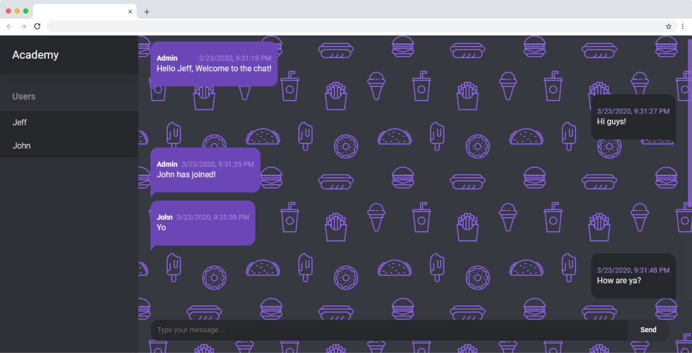

# ChatApp

Lightweight chat app built with Express, Socket.io and Vue.js



## 🛠 Tools

- [Node.js](https://nodejs.org/en/docs/)
- [Vue](https://vuejs.org/)
- [Express](http://expressjs.com/)
- [Socket.io](https://socket.io/)

## 💻 Demo

[Click here](https://chatme-app.netlify.app/)

> [!WARNING]
> Be aware that messages sent on any room are NOT persisted.

## 🚀 Quick Start

> Before running the following commands, please rename `.env.example` to `.env`

### Installation

```bash
git clone https://github.com/jeferson-sb/node-chat-app.git && cd node-chat-app
```

```bash
pnpm i && cd client && pnpm i
```

### Usage

```bash
cd .. && npm run concurrently
```

## 📝License

This project is licensed under the [MIT License](https://github.com/jeferson-sb/node-chat-app/blob/master/LICENSE.md)

`Made with ❤ by Jeferson © 2020`
